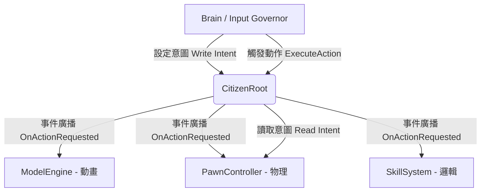

# TRCE Hierarchical Delegation 階層式權力架構指引

## 目錄用途 (Purpose)
本目錄 (`Code/Kernel/Player/Base/`) 存放 **TRCE 架構的權力核心基底組件**。
`CitizenRoot.cs` 是所有複雜實體（玩家、NPC、載具、生物）的最高調度中心。

## 開發規範 (Development Standards)

### 1. 實體開發路徑
嚴禁將具體遊戲邏輯的實體代碼放在 Kernel 中。開發特定實體（例如：Dragon）時，必須在遊戲專屬目錄下建立獨立資料夾：
- **範例路徑**：`Code/Games/MurderMystery/Entities/Dragon/`

### 2. 子系統解耦原則 (Subsystem Decoupling)
具體的邏輯（如物理運動、動畫表現、技能系統）必須實作為獨立的 `Component`。

- **事件驅動**：子系統應在 `OnStart` 中尋找 `CitizenRoot` 組件，並訂閱 `OnActionRequested` 事件來響應動作請求。
- **意圖讀取**：子系統應讀取 `CitizenRoot.Intent` 以獲取移動方向、視角等資料。
- **嚴禁耦合**：子系統之間禁止互相直接引用（例如：`PawnController` 絕對不應直接呼叫 `ModelEngine` 的函數）。所有跨系統的通訊應透過 `CitizenRoot` 廣播或修改共享狀態。
- **禁止越權**：`CitizenRoot` 僅負責資料持有與指令分發，不應包含任何具體的執行邏輯（如 `CharacterController.Move`）。

## 架構圖示

